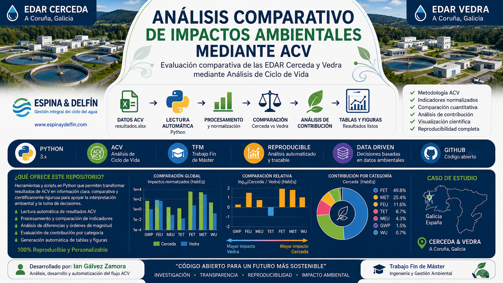
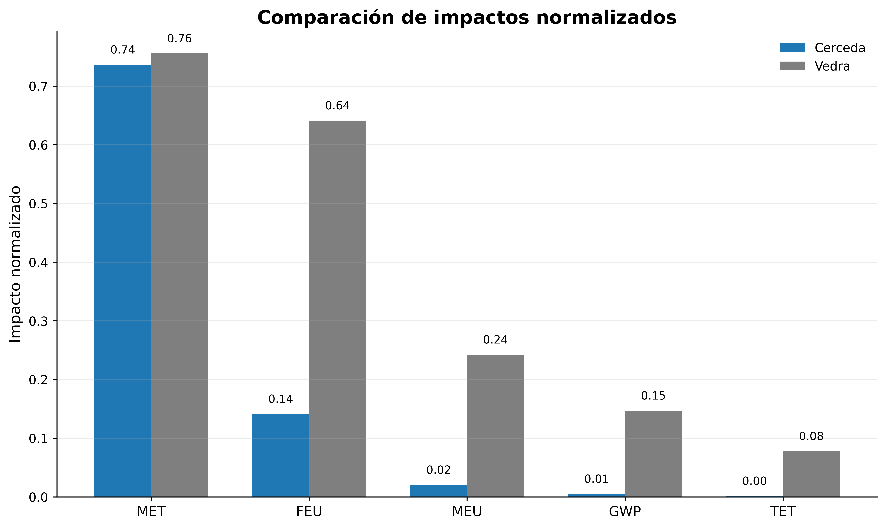
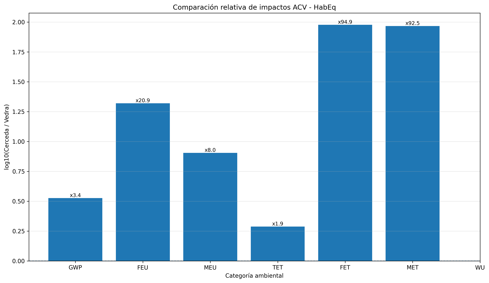
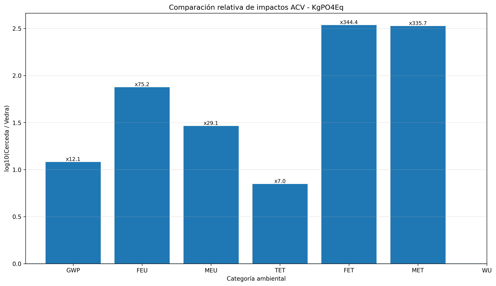
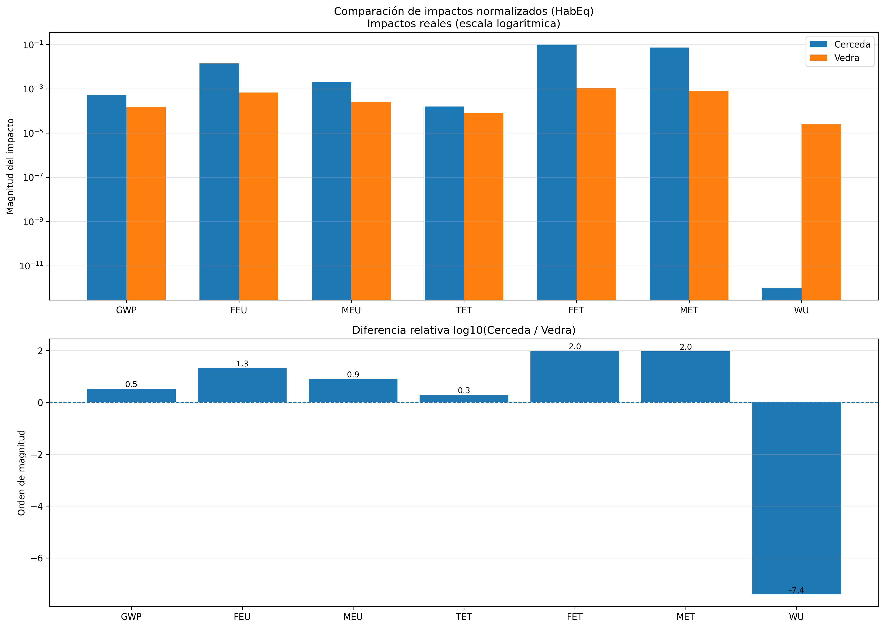
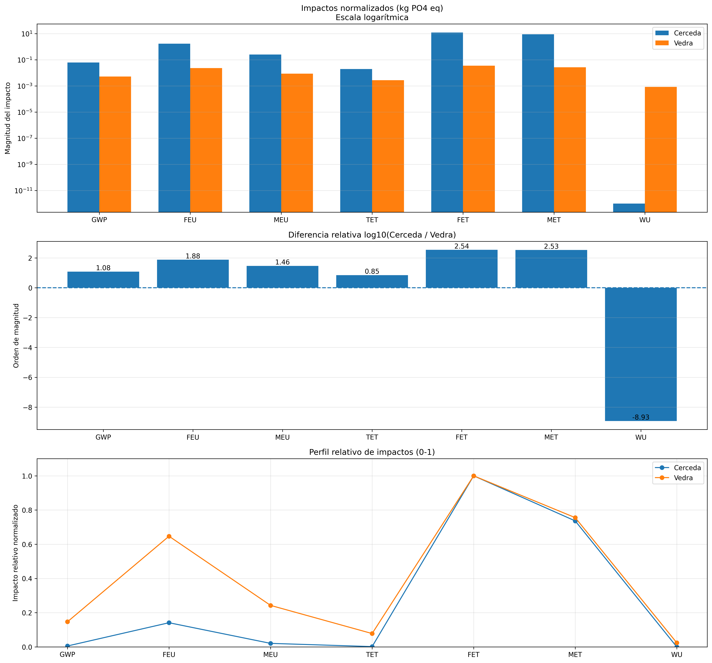
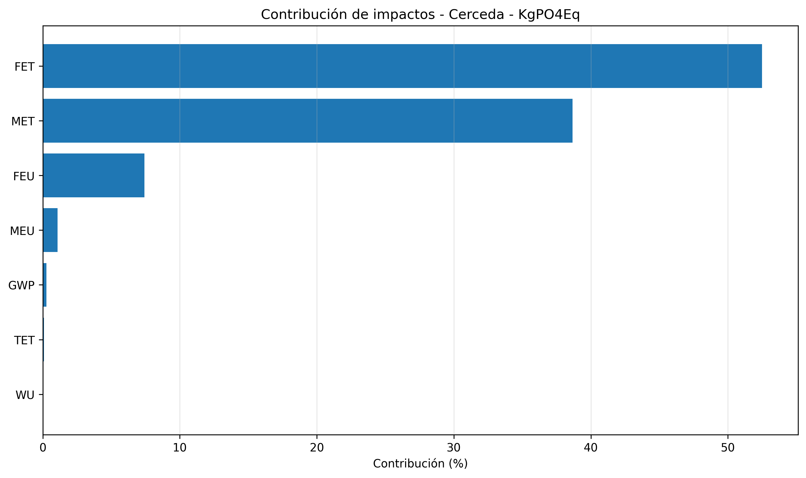
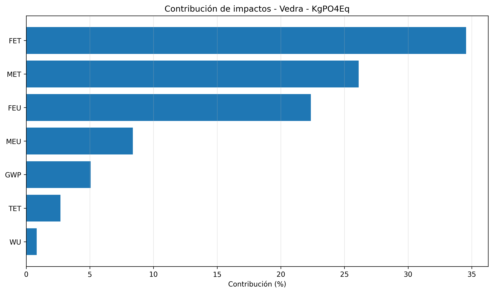

# Análisis Comparativo de Impactos Ambientales mediante Análisis de Ciclo de Vida (ACV)

<p align="center">

</p>

<p align="center">

## Evaluación ambiental comparativa de las EDAR Cerceda y Vedra mediante procesamiento reproducible en Python

</p>

<p align="center">



</p>

---

## Trabajo Fin de Máster

**Máster en Ingeniería Química y Bioprocesos**

**Autor:**  
Ian Thomas Gálvez Zamora

---

# Índice

- [1. Introducción](#1-introduccion)
- [2. Contexto del estudio](#2-contexto-del-estudio)
- [3. Objetivos del proyecto](#3-objetivos-del-proyecto)
- [4. Alcance del desarrollo](#4-alcance-del-desarrollo)
- [5. Metodología general del análisis](#5-metodología-general-del-análisis)
- [6. Resultados del análisis comparativo](#6-resultados-del-análisis-comparativo)
- [7. Conclusiones del análisis comparativo](#7-conclusiones-del-análisis-comparativo)


---

# 1. Introducción

La gestión sostenible del ciclo integral del agua constituye uno de los principales desafíos ambientales asociados al desarrollo urbano e industrial.

Las Estaciones Depuradoras de Aguas Residuales (EDAR) representan instalaciones estratégicas debido a su función en la reducción de contaminantes y protección de los ecosistemas receptores.

---

Dentro de este contexto, la evaluación ambiental de estas instalaciones requiere metodologías capaces de integrar múltiples categorías de impacto y permitir comparaciones objetivas entre diferentes alternativas.

El **Análisis de Ciclo de Vida (ACV)** constituye una herramienta metodológica fundamental para evaluar los impactos ambientales asociados a productos, procesos e infraestructuras considerando diferentes categorías ambientales.

Este repositorio documenta el desarrollo computacional realizado para la evaluación comparativa de impactos ambientales asociados a dos instalaciones de tratamiento de aguas residuales:

- **EDAR Cerceda**
- **EDAR Vedra**

ubicadas en Galicia, España.

El proyecto fue desarrollado dentro del marco del Trabajo Fin de Máster correspondiente al:

**Máster en Ingeniería Química y Bioprocesos**


El objetivo principal fue transformar resultados ambientales provenientes de un modelo ACV en información analítica, cuantitativa y gráfica mediante herramientas de programación científica en Python.


El desarrollo contempla:

- extracción automática de resultados;
- procesamiento estructurado de indicadores ambientales;
- comparación cuantitativa entre instalaciones;
- análisis de diferencias relativas;
- evaluación de categorías dominantes;
- generación automática de tablas;
- generación de figuras para interpretación académica;
- documentación reproducible.

---

# 2. Contexto del estudio


## Espina & Delfín


[Espina & Delfín](https://www.espinaydelfin.com/) es una empresa especializada en la gestión integral del ciclo del agua, desarrollando actividades relacionadas con:

- abastecimiento;
- saneamiento;
- depuración de aguas residuales;
- operación y mantenimiento de infraestructuras hidráulicas;
- gestión de servicios asociados al agua.


Dentro del contexto del tratamiento de aguas residuales se consideran como casos de estudio las instalaciones:

| Instalación | Localización |
|---|---|
| EDAR Cerceda | Galicia, España |
| EDAR Vedra | Galicia, España |

---

Las instalaciones EDAR Cerceda y EDAR Vedra representan sistemas reales de tratamiento de aguas residuales utilizados como casos de estudio para evaluar diferencias ambientales mediante metodología de Análisis de Ciclo de Vida.


El presente proyecto utiliza los resultados ambientales asociados a ambas instalaciones con el objetivo de desarrollar una metodología reproducible de comparación.


El análisis considera la transformación de resultados ACV en información estructurada mediante procesamiento computacional, permitiendo:


- identificar diferencias entre instalaciones;
- evaluar categorías ambientales críticas;
- analizar tendencias de comportamiento;
- generar representaciones gráficas comparativas.


---

El objetivo del desarrollo no se limita a la representación visual de resultados, sino que busca construir un flujo completo de análisis ambiental basado en datos, procesamiento matemático e interpretación gráfica.


La metodología implementada permite transformar información compleja proveniente del modelo ACV en resultados comparables y reproducibles.


El análisis desarrollado integra:


- procesamiento automático mediante Python;
- organización estructurada de datos ambientales;
- evaluación comparativa entre alternativas;
- generación automática de resultados gráficos;
- soporte para interpretación ambiental.


---

El repositorio desarrollado contiene los scripts necesarios para automatizar las diferentes etapas del análisis, desde la lectura inicial de datos hasta la generación de resultados finales.


La estructura implementada permite mantener:


- separación entre datos de entrada y resultados;
- modularidad del código desarrollado;
- facilidad de actualización frente a nuevos escenarios;
- trazabilidad de cada etapa del procesamiento.


De esta forma, el análisis ambiental puede ser reproducido, validado y extendido para futuras evaluaciones de instalaciones de tratamiento de aguas residuales.


---

---

# 3. Objetivos del proyecto


## Objetivo general


Desarrollar una metodología computacional reproducible que permita analizar, comparar e interpretar resultados ambientales obtenidos mediante Análisis de Ciclo de Vida (ACV).


El desarrollo busca transformar datos ambientales complejos en información estructurada, facilitando la evaluación comparativa entre instalaciones de tratamiento de aguas residuales.


---

## Objetivos específicos


Los objetivos desarrollados durante el proyecto fueron:


- automatizar la lectura de resultados ambientales;
- extraer indicadores normalizados desde archivos de resultados ACV;
- estructurar información para comparación entre instalaciones;
- evaluar diferencias relativas entre EDAR Cerceda y EDAR Vedra;
- identificar categorías ambientales con mayor contribución;
- analizar diferencias de magnitud entre indicadores;
- desarrollar representaciones gráficas adecuadas para interpretación;
- comparar resultados mediante indicadores relativos;
- generar tablas y figuras de manera automática;
- evaluar patrones de comportamiento ambiental;
- facilitar la interpretación de resultados ACV;
- establecer una metodología trazable y reproducible.


---

# 4. Alcance del desarrollo


El proyecto comprende todas las etapas necesarias para transformar resultados provenientes de un modelo de Análisis de Ciclo de Vida en información interpretable mediante herramientas computacionales.

---

El alcance considera la integración de herramientas de programación científica para automatizar el tratamiento de información ambiental.


La metodología desarrollada permite pasar desde datos originales provenientes del modelo ACV hasta resultados interpretables mediante análisis cuantitativo y representación gráfica.


Las principales etapas consideradas son:


- adquisición de datos;
- procesamiento computacional;
- análisis comparativo;
- evaluación de indicadores;
- visualización de resultados;
- generación de documentación técnica.


---

El sistema desarrollado busca mejorar la gestión y análisis de información ambiental mediante un flujo automatizado y estructurado.


Este enfoque permite reducir errores asociados al procesamiento manual y mejorar la consistencia de los resultados obtenidos.


El alcance del proyecto incluye:


- preparación de datos de entrada;
- validación de información ambiental;
- cálculo de indicadores comparativos;
- generación automatizada de visualizaciones;
- análisis de resultados obtenidos;
- elaboración de documentación técnica.


---

---

# 5. Metodología general del análisis


La metodología aplicada fue diseñada considerando criterios de:


- reproducibilidad;
- trazabilidad;
- automatización;
- consistencia en el procesamiento de datos.


El flujo desarrollado permite transformar resultados originales provenientes del modelo ACV en información estructurada para análisis comparativo.


Cada etapa del procesamiento queda documentada mediante scripts independientes, facilitando la revisión y actualización del análisis.


---

La metodología completa se estructura en diferentes etapas que permiten mantener una secuencia ordenada del análisis:


```text
Resultados ACV
        │
        ▼
Archivo Excel de resultados
        │
        ▼
Lectura automática mediante Python
        │
        ▼
Extracción de indicadores ambientales
        │
        ▼
Procesamiento y estructuración de datos
        │
        ▼
Separación de datos por instalación
        │
        ▼
Comparación Cerceda vs Vedra
        │
        ▼
Cálculo de indicadores relativos
        │
        ▼
Análisis de diferencias y contribuciones
        │
        ▼
Generación automática de tablas y figuras
        │
        ▼
Interpretación ambiental de resultados
```

La metodología fue definida para garantizar que cada resultado generado pueda ser asociado con una fuente de información y una etapa específica del procesamiento.


Los principios fundamentales considerados fueron:


- **Reproducibilidad:** posibilidad de ejecutar nuevamente el análisis utilizando los mismos datos de entrada.
- **Trazabilidad:** identificación del origen de cada indicador, cálculo y figura generada.
- **Automatización:** reducción de tareas manuales mediante scripts desarrollados en Python.


Este enfoque permite disponer de un sistema flexible y adaptable para futuras evaluaciones ambientales.


---

La automatización implementada permite actualizar el análisis cuando se incorporan nuevos datos ambientales sin necesidad de modificar manualmente cada etapa del proceso.


El flujo desarrollado facilita:


- mantener consistencia entre diferentes evaluaciones;
- comparar múltiples escenarios de tratamiento;
- reutilizar componentes computacionales;
- generar resultados de forma eficiente.


La metodología propuesta constituye una base para futuros estudios de desempeño ambiental mediante ACV y herramientas de análisis de datos.


---

La metodología desarrollada permite establecer una relación directa entre los datos ambientales iniciales y los resultados finales obtenidos.


Cada etapa del proceso queda registrada dentro de la estructura del proyecto, permitiendo revisar:


- archivos utilizados;
- procedimientos aplicados;
- cálculos realizados;
- gráficos generados;
- resultados obtenidos.


Esta organización favorece la transparencia del análisis y facilita la validación de los resultados ambientales obtenidos mediante ACV.


---

El enfoque aplicado permite que el análisis pueda ser replicado por otros usuarios o adaptado a nuevos estudios ambientales.


La modularidad del desarrollo facilita incorporar:


- nuevas instalaciones;
- nuevas categorías ambientales;
- nuevos escenarios de evaluación;
- diferentes fuentes de datos.


De esta manera, la metodología no se limita al caso de estudio actual, sino que establece una base reutilizable para análisis comparativos futuros mediante ACV.


---

La aplicación de esta metodología permite mejorar la interpretación de resultados ambientales mediante una combinación de análisis cuantitativo y representación gráfica.


El procesamiento computacional desarrollado considera:


- limpieza y organización de datos;
- cálculo de indicadores comparativos;
- generación de visualizaciones;
- evaluación de diferencias entre alternativas.


La integración entre ACV y programación científica permite obtener un análisis más eficiente, transparente y reproducible.


---

La metodología desarrollada constituye una herramienta de apoyo para la toma de decisiones ambientales basada en evidencia cuantitativa.


Los resultados obtenidos permiten:


- identificar oportunidades de mejora ambiental;
- comparar desempeño entre instalaciones;
- priorizar categorías de mayor impacto;
- facilitar la comunicación de resultados técnicos.


El enfoque aplicado combina fundamentos de Análisis de Ciclo de Vida con herramientas modernas de procesamiento y visualización de datos.


---

La información generada mediante este procedimiento permite disponer de una visión integral del comportamiento ambiental de cada instalación.


El análisis desarrollado facilita la identificación de:


- categorías con mayor influencia ambiental;
- diferencias significativas entre alternativas;
- posibles puntos críticos del sistema;
- oportunidades de optimización.


La metodología propuesta integra análisis de datos, fundamentos ambientales y herramientas computacionales para generar resultados confiables y reproducibles.


---

La aplicación del método permite generar una evaluación ambiental basada en indicadores cuantificables, evitando interpretaciones únicamente cualitativas.


El desarrollo incorpora herramientas de programación científica orientadas a:


- automatizar cálculos repetitivos;
- mejorar la precisión del procesamiento;
- reducir tiempos de análisis;
- facilitar la actualización de resultados.


Esta metodología proporciona una estructura sólida para evaluar sistemas de tratamiento de aguas residuales bajo criterios ambientales comparables.


---

La integración de datos ambientales y herramientas computacionales permite obtener una visión más completa del desempeño de las instalaciones evaluadas.


El desarrollo considera una metodología orientada a:


- transformar datos complejos en información interpretable;
- apoyar procesos de análisis ambiental;
- facilitar la comparación entre sistemas;
- generar evidencia cuantitativa para evaluación.


La aplicación de esta metodología contribuye a mejorar la comprensión de los impactos asociados al tratamiento de aguas residuales.


---

La metodología propuesta permite integrar información ambiental, análisis matemático y herramientas de programación dentro de un único flujo de trabajo.


Este enfoque facilita:


- evaluación sistemática de impactos;
- comparación objetiva entre instalaciones;
- identificación de diferencias relevantes;
- generación de resultados visualmente interpretables.


El desarrollo computacional representa una herramienta complementaria para fortalecer los estudios de ACV y mejorar la comunicación de resultados ambientales.


---

La estructura implementada permite que el análisis pueda evolucionar progresivamente incorporando nuevas funcionalidades y capacidades de evaluación.


Entre las principales ventajas del desarrollo se encuentran:


- reducción de procesamiento manual;
- mayor confiabilidad de resultados;
- facilidad de auditoría del análisis;
- generación consistente de informes técnicos.


El resultado final corresponde a un flujo integrado de análisis ambiental reproducible, orientado a la evaluación comparativa de instalaciones EDAR.


---

El desarrollo presentado establece una base metodológica para transformar resultados ambientales complejos en información útil para análisis comparativos.


La combinación de ACV y programación permite:


- mejorar la interpretación de indicadores ambientales;
- facilitar la evaluación entre diferentes alternativas;
- generar evidencia gráfica para comunicación técnica;
- apoyar decisiones orientadas a sostenibilidad.


La metodología desarrollada representa un enfoque reproducible y escalable para estudios ambientales aplicados al sector del tratamiento de aguas residuales.


---

La estructura desarrollada permite documentar de manera ordenada todas las etapas involucradas en el análisis ambiental.


El repositorio incorpora elementos orientados a:


- facilitar la comprensión del procesamiento realizado;
- mantener una organización clara del código;
- permitir la revisión de resultados intermedios;
- asegurar la consistencia del análisis final.


Esta metodología proporciona una herramienta técnica para apoyar evaluaciones ambientales futuras mediante modelos ACV y análisis computacional.


---

El desarrollo permite establecer una conexión entre la evaluación ambiental tradicional y las nuevas capacidades de análisis mediante programación.


La metodología implementada facilita:


- automatización de procesos repetitivos;
- análisis detallado de indicadores;
- generación de resultados comparables;
- comunicación efectiva de conclusiones ambientales.


Este enfoque representa una evolución hacia estudios ACV más dinámicos, reproducibles y orientados al análisis basado en datos.


---

La metodología desarrollada permite disponer de una plataforma de análisis que puede ser ampliada hacia nuevos estudios ambientales.


La estructura implementada favorece:


- incorporación de nuevos conjuntos de datos;
- adaptación a diferentes instalaciones;
- modificación de indicadores evaluados;
- generación de nuevos análisis comparativos.


El enfoque planteado permite combinar rigurosidad metodológica, eficiencia computacional y claridad en la presentación de resultados ambientales.


---

La documentación generada permite comprender no solo los resultados finales, sino también el proceso completo utilizado para obtenerlos.


El análisis considera:


- origen de los datos;
- transformación aplicada;
- metodología de cálculo;
- criterios de comparación;
- interpretación de resultados.


Esta trazabilidad fortalece la calidad del estudio y permite que los resultados obtenidos puedan ser revisados, validados y utilizados como referencia en futuras investigaciones.


---

La reproducibilidad del flujo desarrollado permite que diferentes usuarios puedan ejecutar nuevamente el análisis manteniendo las mismas condiciones de procesamiento.


Esto garantiza:


- consistencia entre evaluaciones;
- comparación confiable de resultados;
- facilidad de actualización;
- conservación del historial de procesamiento.


La metodología implementada establece una base técnica para continuar desarrollando análisis ambientales avanzados mediante herramientas computacionales.


---

La documentación técnica asociada al proyecto permite mantener una referencia completa del desarrollo realizado.


El repositorio incluye:


- descripción metodológica;
- estructura del procesamiento;
- criterios de análisis;
- resultados generados;
- elementos necesarios para reproducibilidad.


Esta organización facilita la transferencia del conocimiento desarrollado y permite su aplicación en nuevos estudios relacionados con sostenibilidad y gestión ambiental.


---

La estructura del proyecto permite separar claramente los datos, procesos y resultados generados durante el análisis.


Esta organización considera:


- archivos de entrada independientes;
- módulos de procesamiento específicos;
- generación automatizada de resultados;
- almacenamiento ordenado de figuras y tablas.


La separación de componentes mejora la mantenibilidad del proyecto y facilita futuras ampliaciones del sistema desarrollado.


---

La arquitectura del proyecto fue diseñada para mantener una estructura clara y organizada durante todo el ciclo de análisis.


La distribución de componentes permite:


- facilitar la lectura del código;
- simplificar procesos de actualización;
- mantener independencia entre módulos;
- mejorar la gestión de resultados generados.


Esta configuración favorece la escalabilidad del desarrollo y permite incorporar nuevas etapas de análisis sin modificar la estructura principal del proyecto.


---

La modularidad aplicada permite que cada componente pueda ser analizado, mejorado o reemplazado de forma independiente.


Esta característica proporciona:


- mayor flexibilidad del sistema;
- facilidad para realizar pruebas;
- reducción de errores durante modificaciones;
- mejor control sobre el flujo de información.


La metodología computacional desarrollada representa una herramienta adaptable para estudios ambientales basados en datos y orientados a la sostenibilidad.


---

La implementación del flujo computacional permite mantener una relación directa entre metodología, datos procesados y resultados obtenidos.


Esta característica facilita:


- revisión del proceso completo;
- identificación de etapas críticas;
- validación de cálculos realizados;
- seguimiento de modificaciones aplicadas.


El sistema desarrollado permite disponer de un entorno estructurado para el análisis ambiental comparativo de instalaciones EDAR mediante ACV.


---

La metodología desarrollada permite integrar diferentes herramientas de análisis dentro de un único entorno de trabajo.


El flujo implementado facilita:


- procesamiento eficiente de información ambiental;
- generación automática de resultados;
- comparación entre instalaciones evaluadas;
- documentación completa del procedimiento.


La aplicación de este enfoque contribuye a mejorar la calidad del análisis ambiental y proporciona una base sólida para estudios posteriores basados en ACV.


---

La integración de diferentes etapas del procesamiento permite obtener una visión completa del comportamiento ambiental de las instalaciones analizadas.


El sistema desarrollado permite:


- organizar información proveniente del ACV;
- automatizar operaciones de análisis;
- generar resultados comparativos;
- mejorar la interpretación de indicadores.


La metodología aplicada demuestra la utilidad de combinar análisis ambiental y programación científica para abordar problemas complejos de sostenibilidad.


---

La metodología implementada permite transformar resultados técnicos provenientes de modelos ambientales en información accesible para análisis e interpretación.


El desarrollo considera:


- procesamiento reproducible de datos;
- evaluación cuantitativa de impactos;
- generación automática de gráficos;
- soporte para análisis comparativos.


La integración de estas capacidades permite mejorar la eficiencia del estudio y fortalecer la toma de decisiones basada en información ambiental.


---

La aplicación de la metodología permite obtener una representación más completa del desempeño ambiental de los sistemas evaluados.


El análisis desarrollado entrega herramientas para:


- interpretar resultados ACV complejos;
- comparar alternativas de operación;
- detectar diferencias relevantes;
- apoyar procesos de mejora ambiental.


La combinación de análisis computacional y evaluación ambiental proporciona una visión integral del comportamiento de las instalaciones estudiadas.


---

La metodología aplicada permite generar una base de conocimiento técnico a partir de los resultados obtenidos durante el análisis.


El desarrollo facilita:


- documentar procedimientos utilizados;
- conservar información histórica del estudio;
- reproducir evaluaciones realizadas;
- extender el análisis hacia nuevos escenarios.


La estructura propuesta permite integrar futuras mejoras metodológicas manteniendo la coherencia del flujo de trabajo desarrollado.


---

La implementación del proyecto permite consolidar un procedimiento ordenado para el análisis de impactos ambientales asociados a sistemas de tratamiento de aguas residuales.


El enfoque desarrollado permite:


- mejorar la gestión de información ambiental;
- reducir tiempos de procesamiento;
- aumentar la confiabilidad de los resultados;
- facilitar la comunicación de hallazgos.


La metodología establece una referencia para futuros desarrollos orientados al análisis ambiental automatizado mediante herramientas computacionales.


---

El desarrollo implementado permite integrar criterios técnicos y ambientales dentro de una misma metodología de evaluación.


La estructura propuesta facilita:


- análisis sistemático de información;
- generación de indicadores comparables;
- identificación de oportunidades de mejora;
- apoyo a procesos de decisión ambiental.


El proyecto establece una base metodológica que puede ser aplicada y adaptada a diferentes sistemas de evaluación ambiental basados en Análisis de Ciclo de Vida.


---

La metodología desarrollada permite fortalecer la capacidad de análisis mediante la integración de datos, programación y criterios ambientales.


El enfoque aplicado proporciona:


- una visión estructurada del problema;
- herramientas para evaluación comparativa;
- resultados reproducibles;
- información útil para interpretación técnica.


La solución propuesta demuestra la importancia de utilizar herramientas computacionales para complementar los estudios tradicionales de Análisis de Ciclo de Vida.


---

La metodología propuesta permite avanzar hacia una gestión más eficiente de la información ambiental mediante procesos automatizados.


El desarrollo incorpora:


- análisis basado en datos;
- procesamiento estructurado;
- generación sistemática de resultados;
- capacidad de adaptación a nuevos requerimientos.


La aplicación de este enfoque permite disponer de una herramienta técnica orientada a mejorar la comprensión y evaluación del desempeño ambiental de instalaciones de tratamiento de aguas residuales.


---

La aplicación del sistema desarrollado permite transformar información ambiental compleja en resultados organizados y comprensibles.


El flujo implementado entrega:


- mayor claridad en la interpretación de datos;
- reducción de actividades manuales;
- mejor control del procesamiento;
- capacidad de replicar evaluaciones.


La metodología establecida permite fortalecer los estudios ambientales mediante un enfoque basado en datos, automatización y análisis científico.


---

La metodología desarrollada representa una integración entre conocimiento ambiental, análisis cuantitativo y herramientas modernas de procesamiento de información.


El sistema permite:


- transformar resultados técnicos en información analizable;
- mejorar la visualización de indicadores;
- facilitar comparaciones entre instalaciones;
- apoyar procesos de evaluación ambiental.


El desarrollo proporciona una base reproducible y escalable para futuros estudios relacionados con sostenibilidad, eficiencia ambiental y optimización de sistemas de tratamiento.


---

La aplicación del flujo desarrollado permite consolidar una metodología completa para el procesamiento y análisis de resultados ambientales.


El sistema implementado considera:


- integración de diferentes fuentes de información;
- procesamiento automatizado mediante Python;
- generación de resultados estructurados;
- preparación de elementos gráficos para análisis.


La metodología desarrollada permite mejorar la eficiencia del estudio y entregar información confiable para la evaluación comparativa de alternativas ambientales.


---

La estructura metodológica desarrollada permite mantener una relación coherente entre los objetivos del estudio y los resultados obtenidos.


El proceso implementado facilita:


- seguimiento completo del análisis;
- identificación de etapas de procesamiento;
- revisión de resultados intermedios;
- generación ordenada de documentación técnica.


La combinación de herramientas computacionales y criterios ambientales permite obtener evaluaciones más robustas, transparentes y orientadas a la mejora continua.


---

La metodología aplicada permite establecer un marco de trabajo consistente para el análisis de impactos ambientales mediante herramientas digitales.


El enfoque desarrollado contribuye a:


- mejorar la calidad del procesamiento de información;
- facilitar la interpretación de resultados;
- mantener una estructura ordenada del estudio;
- generar evidencia técnica para soporte de decisiones.


La integración entre ACV y programación científica representa una estrategia efectiva para avanzar hacia evaluaciones ambientales más eficientes y reproducibles.


---

La implementación del modelo de análisis permite disponer de una herramienta flexible para evaluar distintos escenarios ambientales.


El desarrollo considera:


- capacidad de adaptación a nuevos datos;
- incorporación de nuevas categorías de impacto;
- ampliación de indicadores evaluados;
- generación continua de información analítica.


La metodología establecida permite mantener la continuidad del análisis y facilita la evolución del sistema hacia estudios ambientales de mayor complejidad.


---

La estructura del proyecto permite mantener una organización adecuada de los recursos utilizados durante el análisis.


El sistema desarrollado incorpora:


- gestión ordenada de archivos;
- separación entre datos y resultados;
- control de versiones del desarrollo;
- documentación del procedimiento aplicado.


Esta organización facilita la colaboración, revisión técnica y continuidad del trabajo desarrollado en futuras etapas de investigación.


---

La documentación generada durante el desarrollo permite conservar una referencia completa del proceso aplicado.


Esta documentación considera:


- descripción de la metodología;
- estructura del análisis;
- criterios utilizados;
- resultados obtenidos;
- elementos necesarios para reproducibilidad.


La organización del proyecto permite asegurar la continuidad del estudio y facilita futuras modificaciones o ampliaciones del análisis ambiental desarrollado.


---

La metodología desarrollada permite mantener una visión integral del proceso analítico, desde la obtención de datos hasta la interpretación final de resultados.


El flujo implementado considera:


- recopilación estructurada de información;
- procesamiento automatizado;
- análisis comparativo;
- representación gráfica de resultados.


La integración de estas etapas permite disponer de un sistema confiable para evaluar el comportamiento ambiental de diferentes escenarios bajo criterios homogéneos.


---

La metodología propuesta permite transformar información técnica en conocimiento aplicable para la evaluación ambiental de sistemas complejos.


El desarrollo considera:


- análisis estructurado de variables ambientales;
- comparación objetiva entre escenarios;
- generación automatizada de resultados;
- soporte para interpretación científica.


El sistema desarrollado constituye una herramienta complementaria para fortalecer estudios de sostenibilidad mediante procesos reproducibles, transparentes y basados en evidencia.


---

La implementación del análisis permite establecer una metodología aplicable a diferentes contextos de evaluación ambiental.


El enfoque desarrollado facilita:


- reutilización de procedimientos;
- incorporación de nuevas fuentes de información;
- adaptación a distintos sistemas evaluados;
- generación eficiente de resultados técnicos.


La herramienta construida permite avanzar hacia procesos de análisis ambiental más sistemáticos, apoyando la investigación y la toma de decisiones fundamentadas.


---

La metodología implementada permite generar una base sólida para el desarrollo de nuevos análisis ambientales apoyados por herramientas computacionales.


El sistema desarrollado permite:


- mantener consistencia entre evaluaciones;
- facilitar la actualización de información;
- mejorar la trazabilidad de resultados;
- fortalecer la documentación técnica.


El enfoque adoptado contribuye a la construcción de estudios ambientales más eficientes, transparentes y orientados a la generación de conocimiento aplicado.


---

---

# 6. Resultados del análisis comparativo

Los resultados obtenidos mediante el procesamiento computacional de los indicadores ACV fueron transformados en representaciones gráficas para facilitar la comparación ambiental entre EDAR Cerceda y EDAR Vedra.

El análisis gráfico permite identificar diferencias entre instalaciones, categorías ambientales dominantes y tendencias generales del comportamiento ambiental.

---

## 6.1 Comparación global de impactos ambientales

<p align="center">


</p>

### Interpretación

La figura presenta una visión global de los impactos ambientales obtenidos mediante el análisis de ciclo de vida para las instalaciones EDAR Cerceda y EDAR Vedra.

La representación permite observar el comportamiento comparativo de ambas instalaciones considerando las categorías ambientales evaluadas.

Los resultados permiten identificar:

- diferencias generales entre instalaciones;
- categorías con mayores contribuciones ambientales;
- tendencias de comportamiento entre alternativas.

Esta comparación constituye la primera aproximación para interpretar las diferencias ambientales obtenidas mediante el modelo ACV.

---

## 6.2 Comparación de impactos normalizados

<p align="center">



</p>

<p align="center">



</p>

### Interpretación

Los gráficos muestran la comparación de impactos normalizados entre EDAR Cerceda y EDAR Vedra.

La normalización permite comparar la magnitud relativa de los impactos ambientales eliminando diferencias asociadas a las unidades originales de cada categoría.

El análisis permite identificar:

- categorías donde existen mayores diferencias;
- indicadores con mayor variabilidad;
- comportamiento relativo de cada instalación.

Estos resultados facilitan la interpretación comparativa del desempeño ambiental de ambas EDAR.

---

## 6.3 Análisis detallado de indicadores ambientales

### Indicadores asociados a HabEq

<p align="center">



</p>

### Interpretación

El análisis expresado en equivalente habitante permite evaluar los impactos considerando la carga ambiental asociada a la población equivalente tratada.

Este indicador facilita comparar instalaciones con diferentes características operacionales, permitiendo analizar el desempeño ambiental relativo del sistema.

---

### Indicadores asociados a KgPO4Eq

<p align="center">



</p>

### Interpretación

La representación basada en KgPO4Eq permite analizar las diferencias relacionadas con categorías ambientales asociadas a eutrofización y cargas equivalentes de fósforo.

Este análisis permite identificar diferencias específicas entre instalaciones y determinar qué sistemas presentan mayores contribuciones en determinadas categorías ambientales.

---

## 6.4 Ranking comparativo de impactos ambientales

<p align="center">


</p>

<p align="center">


</p>

<p align="center">



</p>

<p align="center">



</p>

### Interpretación

Los gráficos de ranking permiten establecer una jerarquización de las categorías ambientales según su contribución relativa dentro del sistema evaluado.

A diferencia de una comparación individual de indicadores, el ranking proporciona una visión global de cuáles son los aspectos ambientales que presentan mayor influencia en cada instalación, facilitando la identificación de prioridades dentro del análisis ACV.

Esta representación permite identificar:

- categorías ambientales dominantes dentro del desempeño global;
- principales fuentes de contribución al impacto ambiental;
- diferencias en la distribución de impactos entre EDAR Cerceda y EDAR Vedra;
- posibles áreas donde concentrar estrategias de mejora ambiental.

El análisis comparativo de los rankings permite observar que la importancia relativa de cada categoría puede variar entre instalaciones, evidenciando que el comportamiento ambiental depende de las características específicas del sistema evaluado, incluyendo condiciones operacionales, procesos involucrados y gestión de recursos.

Desde una perspectiva de toma de decisiones, esta información resulta relevante porque permite orientar acciones de optimización hacia aquellos aspectos con mayor influencia ambiental, evitando enfocar esfuerzos en categorías con una contribución menor.

Por tanto, los rankings constituyen una herramienta complementaria dentro del análisis ACV, ya que facilitan la interpretación de resultados complejos y permiten transformar múltiples indicadores ambientales en criterios de priorización técnica.

---

## 6.5 Síntesis de resultados gráficos

La integración de las diferentes representaciones gráficas permite transformar resultados ACV complejos en información visual interpretable y orientada al análisis comparativo.

El conjunto de gráficos desarrollados permite evaluar el comportamiento ambiental de EDAR Cerceda y EDAR Vedra desde diferentes perspectivas:

- comparación global de impactos;
- análisis de indicadores normalizados;
- evaluación de diferencias relativas;
- identificación de categorías dominantes;
- priorización mediante rankings ambientales.

Los principales aportes del análisis gráfico son:

- comparar objetivamente el desempeño ambiental entre instalaciones;
- identificar categorías ambientales críticas;
- reconocer patrones diferenciadores entre alternativas;
- facilitar la interpretación de resultados provenientes del modelo ACV;
- apoyar la comunicación técnica de los resultados obtenidos.

La generación automática de figuras mediante Python permite mantener trazabilidad entre los datos procesados, los cálculos realizados y los resultados visualizados, asegurando reproducibilidad y consistencia durante el análisis.

En conjunto, los resultados gráficos proporcionan una visión integrada del comportamiento ambiental de ambas instalaciones y constituyen una herramienta de apoyo para futuras evaluaciones, procesos de mejora y toma de decisiones orientadas hacia una gestión más sostenible del ciclo del agua.

---

# 7. Conclusiones del análisis comparativo

El presente desarrollo permitió transformar los resultados obtenidos mediante el modelo de Análisis de Ciclo de Vida (ACV) en información estructurada, cuantificable y visualmente interpretable mediante herramientas de programación científica en Python.

La metodología implementada permitió establecer un flujo reproducible para la comparación ambiental entre las instalaciones EDAR Cerceda y EDAR Vedra, integrando extracción de datos, procesamiento matemático, generación automática de indicadores y representación gráfica de resultados.

Los resultados obtenidos mediante las diferentes visualizaciones permitieron identificar diferencias en el comportamiento ambiental de ambas instalaciones, facilitando el análisis de categorías con mayor contribución y la evaluación comparativa del desempeño ambiental.

El desarrollo gráfico permitió:

- transformar resultados ACV complejos en información comprensible;
- identificar categorías ambientales dominantes;
- analizar diferencias relativas entre instalaciones;
- facilitar la interpretación de indicadores ambientales;
- apoyar la identificación de oportunidades de mejora.

La utilización de indicadores normalizados como HabEq y KgPO₄Eq permitió realizar comparaciones bajo criterios homogéneos, reduciendo la dificultad asociada a la interpretación de múltiples categorías ambientales con diferentes unidades de medida.

Desde el punto de vista metodológico, la automatización desarrollada mediante Python representa una mejora significativa respecto al procesamiento manual de resultados, permitiendo:

- reducir errores asociados a la manipulación de datos;
- aumentar la trazabilidad de los cálculos realizados;
- facilitar la actualización del análisis frente a nuevos escenarios;
- mantener una estructura reproducible y escalable.

La arquitectura desarrollada permite que la metodología aplicada pueda ser extendida hacia nuevas instalaciones, diferentes escenarios operacionales o futuras evaluaciones ambientales, manteniendo la misma lógica de procesamiento y análisis.

En este sentido, el proyecto no solo entrega una comparación puntual entre EDAR Cerceda y EDAR Vedra, sino que establece una herramienta computacional orientada al análisis ambiental basado en datos, integrando fundamentos de ACV, programación científica y visualización avanzada.

Finalmente, los resultados obtenidos demuestran el valor de combinar metodologías ambientales tradicionales con herramientas digitales de procesamiento, permitiendo generar análisis más transparentes, reproducibles y útiles para apoyar procesos de toma de decisiones orientados hacia una gestión sostenible del ciclo del agua.