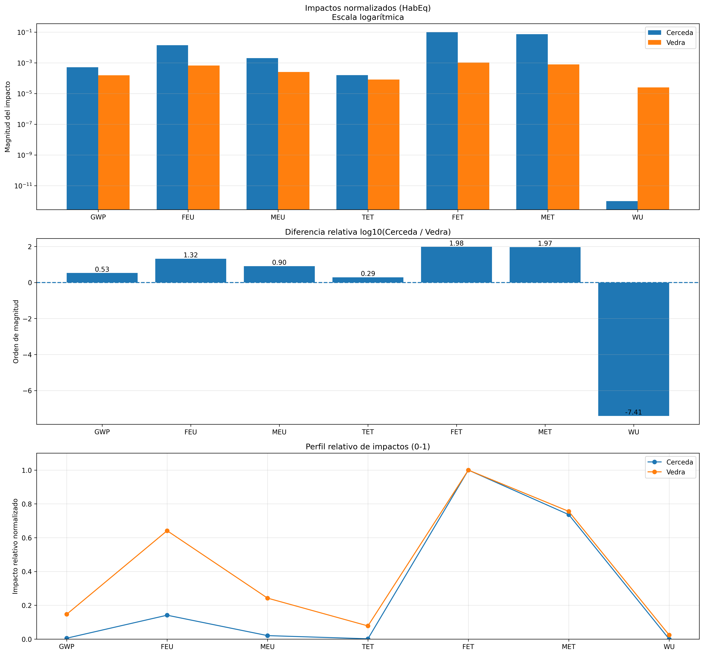
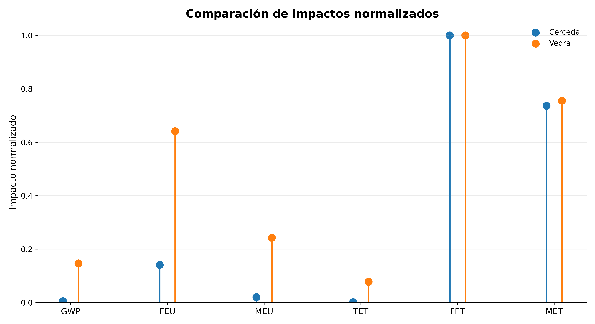
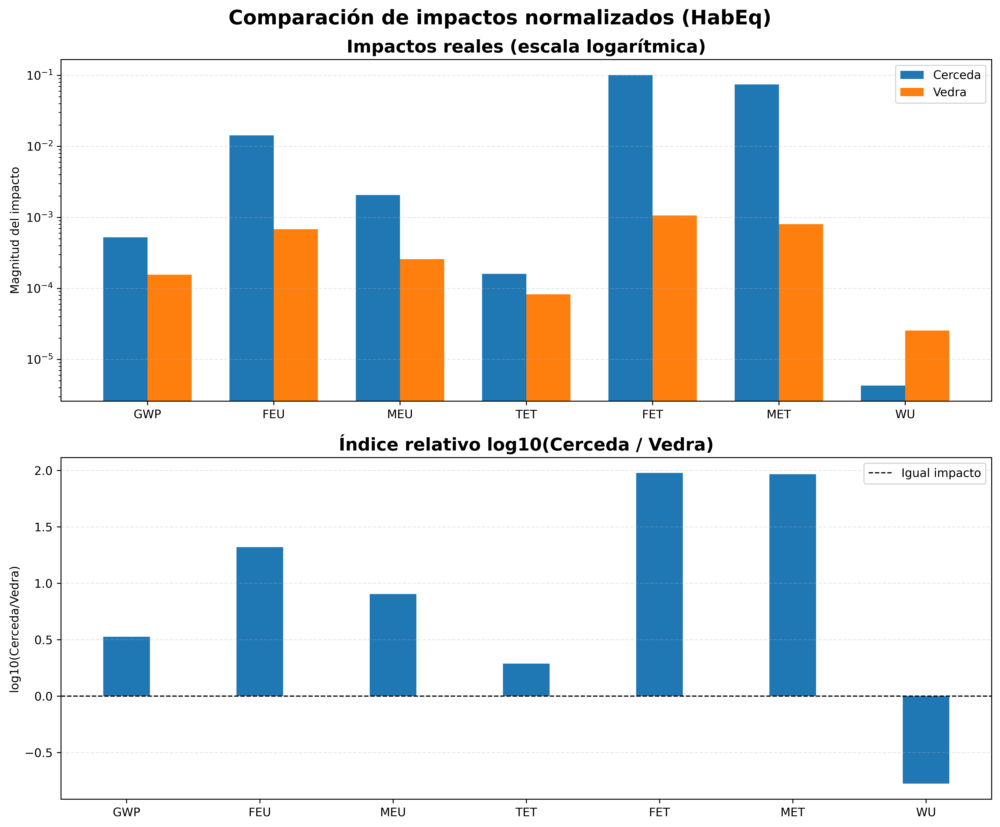

Análisis Comparativo de Impactos Ambientales mediante Análisis de Ciclo de Vida (ACV)

  

Evaluación ambiental comparativa de las EDAR Cerceda y Vedra mediante procesamiento reproducible en Python

  

Índice
Introducción
Contexto del estudio
Objetivos del proyecto
Alcance del desarrollo
Metodología general del análisis
Datos utilizados
Categorías ambientales evaluadas
Desarrollo computacional
Procesamiento y preparación de datos
Análisis exploratorio inicial
Evaluación gráfica y selección de representaciones
Análisis comparativo de impactos
Análisis de contribución ambiental
Resultados principales
Visualización final de resultados
Reproducibilidad del análisis
Conclusiones
Autor
1. Introducción

La gestión sostenible del ciclo integral del agua constituye uno de los principales desafíos ambientales asociados al desarrollo urbano, industrial y territorial.

Las Estaciones Depuradoras de Aguas Residuales (EDAR) representan infraestructuras fundamentales dentro del ciclo del agua debido a su función en:

reducción de cargas contaminantes;
protección de ecosistemas receptores;
mejora de la calidad del agua tratada;
optimización del uso de recursos;
reducción de impactos ambientales asociados al tratamiento de aguas residuales.

Sin embargo, la evaluación ambiental de estas instalaciones requiere metodologías capaces de integrar múltiples categorías de impacto y permitir comparaciones objetivas entre diferentes sistemas.

En este contexto, el Análisis de Ciclo de Vida (ACV) constituye una metodología ampliamente utilizada para evaluar impactos ambientales asociados a productos, procesos e infraestructuras, considerando diferentes categorías ambientales.

Este repositorio documenta el desarrollo computacional realizado para la evaluación comparativa de impactos ambientales asociados a dos instalaciones de tratamiento de aguas residuales:

EDAR Cerceda
EDAR Vedra

ubicadas en Galicia, España.

El proyecto fue desarrollado en el marco del Trabajo Fin de Máster:

Máster en Ingeniería Química y Bioprocesos

El objetivo principal fue transformar resultados ambientales provenientes de un modelo ACV en información analítica, cuantitativa y gráfica mediante herramientas de programación científica en Python.

El desarrollo contempla:

extracción automática de resultados;
procesamiento estructurado de indicadores ambientales;
comparación cuantitativa entre instalaciones;
análisis de diferencias relativas;
evaluación de categorías dominantes;
generación automática de tablas;
generación de figuras para interpretación académica;
documentación reproducible del procedimiento.
2. Contexto del estudio
Espina & Delfín

Espina & Delfín es una empresa especializada en la gestión integral del ciclo del agua, desarrollando actividades relacionadas con:

abastecimiento;
saneamiento;
tratamiento de aguas residuales;
operación y mantenimiento de infraestructuras hidráulicas;
gestión de servicios asociados al agua.

Dentro del contexto del tratamiento de aguas residuales se consideran como caso de estudio dos instalaciones:

Instalación	Localización
EDAR Cerceda	Galicia, España
EDAR Vedra	Galicia, España

El presente proyecto utiliza los resultados ambientales asociados a ambas instalaciones para desarrollar una metodología reproducible de comparación mediante indicadores provenientes del Análisis de Ciclo de Vida.

El propósito del desarrollo no consiste únicamente en representar gráficamente resultados, sino en construir un flujo completo de análisis que permita:

interpretar diferencias ambientales;
identificar categorías críticas;
comparar comportamientos entre instalaciones;
apoyar procesos de evaluación ambiental.

3. Objetivos del proyecto
Objetivo general

Desarrollar una metodología computacional reproducible que permita analizar, comparar e interpretar resultados ambientales obtenidos mediante Análisis de Ciclo de Vida (ACV), utilizando herramientas de programación científica en Python.

El desarrollo busca transformar datos ambientales complejos en información estructurada que facilite la evaluación comparativa entre instalaciones de tratamiento de aguas residuales.

Objetivos específicos

Los objetivos desarrollados durante el proyecto fueron:

automatizar la lectura de resultados ambientales provenientes de archivos Excel;
extraer indicadores ambientales normalizados desde resultados ACV;
estructurar los datos para realizar comparaciones entre instalaciones;
procesar información correspondiente a las plantas Cerceda y Vedra;
evaluar diferencias relativas entre ambas instalaciones;
identificar categorías ambientales con mayor influencia;
analizar diferencias de magnitud entre indicadores;
estudiar alternativas de representación gráfica;
seleccionar visualizaciones adecuadas para interpretación académica;
generar tablas comparativas automáticamente;
desarrollar análisis de contribución ambiental;
crear un flujo reproducible mediante scripts Python.
4. Alcance del desarrollo

El proyecto comprende todas las etapas necesarias para transformar resultados provenientes de un modelo de Análisis de Ciclo de Vida en información interpretable mediante herramientas computacionales.

El alcance considera:

Entrada del sistema

Resultados ambientales obtenidos desde un modelo ACV y exportados en formato Excel.

La información inicial contiene:

categorías ambientales evaluadas;
indicadores normalizados;
valores asociados a cada instalación;
unidades ambientales utilizadas en la evaluación.
Procesamiento computacional

Los datos son procesados mediante Python mediante una arquitectura modular que permite separar las diferentes etapas del análisis.

Las principales etapas desarrolladas fueron:

Resultados ACV
        │
        ▼
Archivo Excel de resultados
        │
        ▼
Lectura automática mediante Python
        │
        ▼
Extracción de indicadores ambientales
        │
        ▼
Procesamiento y limpieza de datos
        │
        ▼
Separación Cerceda / Vedra
        │
        ▼
Comparación cuantitativa
        │
        ▼
Evaluación relativa
        │
        ▼
Análisis de contribución
        │
        ▼
Generación de figuras
        │
        ▼
Interpretación ambiental
Resultados generados

El sistema desarrollado permite obtener:

tablas comparativas;
indicadores relativos;
análisis de diferencias;
gráficos comparativos;
rankings ambientales;
análisis de contribución;
figuras preparadas para documentación académica.
5. Metodología general del análisis

La metodología aplicada fue desarrollada considerando tres principios fundamentales:

Reproducibilidad

Cada etapa del procesamiento puede ejecutarse nuevamente utilizando los mismos archivos de entrada y obteniendo resultados equivalentes.

Trazabilidad

Cada resultado generado puede asociarse con:

archivo de origen;
proceso aplicado;
script utilizado;
figura o tabla resultante.
Automatización

El flujo desarrollado permite reducir tareas manuales asociadas a:

copia de datos;
elaboración de gráficos;
cálculo de diferencias;
actualización de resultados.

La metodología completa se estructura en las siguientes fases:

Fase 1: Preparación de datos

En esta etapa se realiza:

identificación del archivo fuente;
lectura de resultados ACV;
extracción de indicadores ambientales;
organización de datos por instalación.
Fase 2: Procesamiento de indicadores

Los valores obtenidos son estructurados para permitir:

comparación directa;
análisis matemático;
generación de gráficos;
evaluación de tendencias.
Fase 3: Análisis exploratorio

Antes de seleccionar una representación definitiva se analizaron diferentes alternativas gráficas con el objetivo de determinar cuál permitía interpretar correctamente los resultados.

Esta etapa fue fundamental debido a que los indicadores ambientales presentaban diferencias significativas de magnitud entre categorías.

Fase 4: Evaluación comparativa

Se desarrollaron cálculos orientados a determinar:

diferencias relativas entre plantas;
categorías con mayor variación;
órdenes de magnitud;
comportamiento comparativo Cerceda/Vedra.
Fase 5: Comunicación de resultados

Finalmente se generaron:

figuras comparativas;
tablas resumen;
análisis de contribución;
documentación técnica reproducible.
6. Datos utilizados
Archivo de entrada

Los datos utilizados como base del análisis corresponden al archivo:

data/resultados.xlsx
Hoja analizada

La información utilizada corresponde a la hoja:

Evaluación de Impactos

Desde esta fuente fueron extraídos los indicadores ambientales normalizados correspondientes a:

Instalación	Descripción
Cerceda	Planta de tratamiento de aguas residuales
Vedra	Planta de tratamiento de aguas residuales

Los datos originales contienen:

categorías ambientales;
valores normalizados;
indicadores por instalación;
unidades ambientales asociadas.

Estos datos constituyen la base para todo el procesamiento posterior desarrollado mediante Python.

7. Categorías ambientales evaluadas

El análisis comparativo considera diferentes categorías ambientales obtenidas desde el modelo de Análisis de Ciclo de Vida.

Estas categorías permiten evaluar distintos tipos de impactos asociados al funcionamiento de las instalaciones de tratamiento de aguas residuales.

Las categorías consideradas son:

Código	Categoría ambiental	Descripción
GWP	Global Warming Potential	Potencial de calentamiento global asociado a emisiones de gases de efecto invernadero
FEU	Freshwater Ecotoxicity	Impacto asociado a toxicidad sobre ecosistemas de agua dulce
MEU	Marine Ecotoxicity	Impacto asociado a toxicidad sobre ecosistemas marinos
TET	Terrestrial Ecotoxicity	Impacto asociado a toxicidad sobre ecosistemas terrestres
FET	Freshwater Ecotoxicity	Categoría específica de ecotoxicidad en agua dulce
MET	Marine Ecotoxicity	Categoría asociada a ecotoxicidad marina
WU	Water Use	Uso y consumo de recursos hídricos

Los resultados fueron evaluados utilizando dos unidades principales:

HabEq

La unidad Habitant Equivalent (HabEq) permite expresar impactos ambientales normalizados respecto a una referencia poblacional equivalente.

Esta representación facilita la interpretación ambiental al transformar valores absolutos en indicadores comparables.

kg PO4 eq

La unidad kg PO4 equivalente se utiliza principalmente para expresar categorías relacionadas con potenciales de eutrofización.

Permite comparar impactos asociados a aportes equivalentes de fosfatos dentro del sistema ambiental.

El uso combinado de ambas representaciones permitió evaluar:

magnitud absoluta relativa;
diferencias entre instalaciones;
categorías dominantes;
comportamiento comparativo entre Cerceda y Vedra.
8. Desarrollo computacional

El procesamiento fue desarrollado utilizando Python mediante una arquitectura modular.

La estructura modular permitió separar las diferentes etapas del análisis, facilitando:

mantenimiento del código;
reutilización de funciones;
validación independiente de resultados;
actualización frente a nuevos datos.
Estructura general del procesamiento

El flujo computacional desarrollado fue:

Archivo Excel
      │
      ▼
Lector de datos
      │
      ▼
Procesamiento de indicadores
      │
      ▼
Análisis comparativo
      │
      ▼
Evaluación matemática
      │
      ▼
Generación de tablas
      │
      ▼
Generación de figuras
Estructura del repositorio

El proyecto está organizado de la siguiente manera:

TFM_ACV_Cerceda_Vedra

│
├── assets
│   └── banner_TFM_Ian.png
│
├── data
│   └── resultados.xlsx
│
├── docs
│   ├── metodologia.md
│   ├── resultados.md
│   └── interpretacion.md
│
├── figuras
│   └── imágenes generadas del análisis
│
├── resultados
│   ├── tablas comparativas
│   ├── archivos CSV
│   ├── análisis de contribución
│   └── resúmenes de resultados
│
├── src
│   ├── lector_excel.py
│   ├── procesador.py
│   ├── analisis_acv.py
│   ├── analisis_contribucion.py
│   ├── tabla_comparativa.py
│   └── figura_final_acv.py
│
├── graficos_acv.py
│
├── requirements.txt
│
└── README.md
Descripción de módulos principales
lector_excel.py

Responsable de la lectura inicial de información.

Funciones principales:

apertura del archivo Excel;
identificación de hojas disponibles;
extracción estructurada de datos;
validación inicial de información.
procesador.py

Módulo encargado de preparar los datos para análisis.

Funciones principales:

selección de categorías ambientales;
separación de datos por instalación;
organización de vectores comparativos;
preparación de estructuras para gráficos.
analisis_acv.py

Módulo principal de evaluación comparativa.

Funciones:

procesamiento general de indicadores;
cálculo de diferencias;
generación de análisis comparativos;
exportación de resultados.
analisis_contribucion.py

Módulo destinado a identificar la importancia relativa de cada categoría ambiental.

Permite:

determinar categorías dominantes;
calcular contribuciones;
generar rankings ambientales.
tabla_comparativa.py

Responsable de generar tablas estructuradas.

Incluye:

valores Cerceda;
valores Vedra;
diferencias relativas;
interpretación automática.
figura_final_acv.py

Módulo encargado de generar las figuras finales utilizadas para interpretación.

Funciones:

creación de gráficos comparativos;
aplicación de formato homogéneo;
exportación en alta resolución.
9. Procesamiento y preparación de datos
9.1 Lectura automática de resultados

La primera etapa del procesamiento corresponde a la extracción automática de información desde el archivo Excel.

El proceso evita la manipulación manual de datos, reduciendo posibles errores asociados a:

copia de valores;
transcripción;
modificación accidental de tablas.

La información extraída es almacenada en estructuras de datos que permiten continuar con las siguientes etapas del análisis.

9.2 Normalización y organización

Una vez obtenidos los datos originales se realiza una etapa de preparación donde se organizan:

categorías ambientales;
valores asociados a Cerceda;
valores asociados a Vedra;
unidades de análisis.

Esta etapa permite generar una base homogénea para efectuar comparaciones directas.

9.3 Preparación para análisis gráfico

Los datos procesados son utilizados para construir diferentes representaciones:

gráficos de barras;
gráficos comparativos;
escalas logarítmicas;
rankings;
análisis de contribución.

La generación automática permite mantener consistencia visual entre todas las figuras obtenidas.

10. Desarrollo del análisis exploratorio

Antes de establecer la representación gráfica definitiva de los resultados, se desarrolló una etapa exploratoria cuyo objetivo fue comprender el comportamiento de los indicadores ambientales y determinar la mejor forma de comunicar las diferencias existentes entre las instalaciones evaluadas.

Esta etapa fue fundamental debido a que los resultados ACV presentaban diferencias importantes entre categorías ambientales, generando dificultades para visualizar simultáneamente impactos de magnitudes muy distintas.

10.1 Primera aproximación: representación directa de impactos normalizados

La primera alternativa evaluada correspondió a la representación directa de los valores normalizados mediante gráficos de barras.

El objetivo inicial fue observar:

comportamiento general de las categorías ambientales;
diferencias entre Cerceda y Vedra;
identificación preliminar de categorías dominantes.

Ejemplo:

  

Esta representación permitió identificar rápidamente que algunas categorías presentaban valores considerablemente superiores respecto de otras.

Sin embargo, también evidenció una limitación importante:

Las categorías con valores pequeños quedaban visualmente ocultas debido a la diferencia de escala existente entre impactos.

10.2 Problema identificado durante la visualización

Durante la evaluación inicial se observó que la representación mediante escala lineal no permitía interpretar correctamente todas las categorías ambientales.

El principal problema correspondía a la diferencia de órdenes de magnitud entre indicadores.

Algunas categorías presentaban valores elevados, mientras que otras tenían magnitudes significativamente menores.

Como consecuencia:

los impactos dominantes ocupaban prácticamente toda la escala gráfica;
las categorías de menor magnitud perdían visibilidad;
la comparación visual podía inducir a una interpretación incompleta.

Este comportamiento se observa especialmente en categorías como:

FET;
MET;
FEU.

Estas categorías presentaban diferencias relativas muy superiores respecto al resto de indicadores.

Por esta razón fue necesario evaluar representaciones alternativas que permitieran conservar información tanto de categorías dominantes como de aquellas con menor magnitud.

11. Evaluación de alternativas gráficas

Con el objetivo de seleccionar una representación adecuada para la comunicación de resultados, se desarrollaron diferentes alternativas gráficas.

Las representaciones evaluadas fueron:

11.1 Gráfico de barras verticales

La primera alternativa correspondió a un gráfico tradicional de barras.

Ventajas:

lectura sencilla;
comparación directa;
adecuada para documentos académicos.

Limitación:

dificultad para representar simultáneamente valores con grandes diferencias de magnitud.
11.2 Gráfico de barras horizontales

Se evaluó también una representación horizontal.

Ventajas:

permite incluir etiquetas extensas;
facilita ordenar categorías.

Limitación:

mantiene el problema asociado a diferencias extremas de escala.
11.3 Gráfico tipo Lollipop

Se analizó la representación mediante gráficos tipo Lollipop.

Ejemplo:

  

Esta alternativa permite reducir la carga visual y destacar diferencias entre valores.

Sin embargo, para el objetivo del estudio no entregaba ventajas suficientes frente a un gráfico de barras convencional.

11.4 Comparación mediante escala logarítmica

Debido a las diferencias significativas observadas entre categorías, se incorporó una representación logarítmica.

Ejemplo:

  

La escala logarítmica permitió:

visualizar diferencias de varios órdenes de magnitud;
comparar categorías dominantes y menores;
analizar relaciones relativas entre instalaciones.

Esta representación fue especialmente útil para interpretar ratios elevados como:

FET;
MET;
FEU.
11.5 Comparación relativa Cerceda/Vedra

Además de representar valores absolutos normalizados, se desarrolló un análisis basado en la relación entre ambas instalaciones.

El objetivo fue responder:

¿Cuántas veces mayor o menor es el impacto de una instalación respecto de la otra?

Para ello se calculó:

R
i
	​

=
Impacto
Vedra
	​

Impacto
Cerceda
	​

	​

Este indicador permitió transformar una comparación visual en una evaluación cuantitativa.

Ejemplo:

  

12. Selección de la representación final

Después de evaluar las diferentes alternativas se seleccionó una combinación de representaciones complementarias:

Para interpretación general:

Gráficos de barras con impactos normalizados.

Para análisis profundo:
escalas logarítmicas;
ratios comparativos;
rankings;
análisis de contribución.

La combinación permitió:

mantener una lectura clara;
conservar información de categorías pequeñas;
identificar impactos dominantes;
justificar cuantitativamente las diferencias observadas.
13. Metodología matemática comparativa

Para cuantificar las diferencias entre instalaciones se utilizaron indicadores relativos.

13.1 Ratio Cerceda/Vedra

El primer indicador calculado fue:

R
i
	​

=
Impacto
Vedra
	​

Impacto
Cerceda
	​

	​

donde:

R
i
	​

 corresponde al ratio de comparación;
Impacto
Cerceda
	​

 corresponde al valor normalizado de Cerceda;
Impacto
Vedra
	​

 corresponde al valor normalizado de Vedra.
Interpretación del ratio
Ratio	Interpretación
R ≈ 1	impactos similares
R > 1	mayor impacto relativo de Cerceda
R < 1	mayor impacto relativo de Vedra
13.2 Diferencia de orden de magnitud

Para representar diferencias elevadas se utilizó una transformación logarítmica:

D
i
	​

=log
10
	​

(R
i
	​

)

Esta transformación permite representar diferencias relativas independientes de la magnitud absoluta del indicador.

Ejemplo:

una diferencia de 10 veces corresponde a un orden de magnitud;
una diferencia de 100 veces corresponde a dos órdenes de magnitud.

Esta metodología permitió interpretar correctamente categorías donde la diferencia entre instalaciones era demasiado elevada para una escala lineal convencional.

14. Análisis de contribución ambiental

Además del análisis comparativo directo entre Cerceda y Vedra, se desarrolló un análisis de contribución ambiental con el objetivo de identificar qué categorías presentan mayor influencia dentro del comportamiento ambiental de cada instalación.

Mientras que la comparación directa permite responder:

¿Qué instalación presenta un mayor impacto en una determinada categoría ambiental?

el análisis de contribución permite responder:

¿Qué categorías ambientales son responsables de la mayor proporción del impacto observado en cada instalación?

Este análisis resulta fundamental debido a que una diferencia elevada entre instalaciones no necesariamente implica que una categoría sea dominante dentro del comportamiento global de una planta.

Por esta razón, se incorporó una evaluación complementaria basada en la contribución relativa de cada categoría.

14.1 Objetivos del análisis de contribución

El análisis de contribución fue desarrollado para:

identificar categorías ambientales dominantes;
determinar cuáles indicadores concentran la mayor influencia;
establecer prioridades para interpretación ambiental;
complementar la comparación directa entre instalaciones;
apoyar la identificación de oportunidades de mejora.

La metodología permitió transformar los valores individuales de impacto en una distribución porcentual, facilitando la interpretación del comportamiento ambiental global.

14.2 Metodología aplicada

Para cada instalación se analizaron los valores correspondientes a las diferentes categorías ambientales.

El procedimiento desarrollado considera:

extracción de valores normalizados;
organización de categorías ambientales;
cálculo de contribuciones relativas;
ordenamiento descendente de resultados;
generación de gráficos de ranking.

La contribución porcentual fue calculada considerando la participación de cada categoría respecto al total de impactos evaluados.

La expresión utilizada corresponde a:

Contribuci
o
ˊ
n
i
	​

(%)=
∑Impactos
Impacto
i
	​

	​

×100

donde:

Impacto
i
	​

 corresponde al valor de una categoría ambiental específica;
∑Impactos corresponde a la suma de todas las categorías evaluadas.
14.3 Resultados del análisis de contribución
Contribución ambiental EDAR Cerceda

  

El análisis realizado para Cerceda permitió identificar las categorías con mayor participación relativa dentro del conjunto de impactos evaluados.

Los resultados muestran que determinadas categorías concentran la mayor parte de la contribución ambiental, destacando especialmente aquellas relacionadas con:

toxicidad acuática;
impactos asociados a ecosistemas marinos y de agua dulce.

Esta información permite orientar la interpretación hacia los indicadores ambientalmente más relevantes.

Contribución ambiental EDAR Vedra

  

Para Vedra se realizó el mismo procedimiento de análisis.

La comparación de ambos perfiles permite observar que las instalaciones no solamente presentan diferencias en magnitud absoluta, sino también diferencias en la distribución interna de sus categorías ambientales.

Esto resulta relevante debido a que dos instalaciones pueden presentar impactos totales diferentes, pero con estructuras ambientales dominadas por categorías distintas.

15. Resultados comparativos principales

El análisis comparativo permitió cuantificar las diferencias ambientales existentes entre las instalaciones Cerceda y Vedra.

Para ello se utilizaron:

valores normalizados;
ratios Cerceda/Vedra;
diferencias logarítmicas;
análisis de contribución.

Los resultados fueron generados automáticamente mediante Python y almacenados en archivos de salida:

resultados/

incluyendo:

tablas Excel;
archivos CSV;
resúmenes de resultados;
indicadores comparativos.
15.1 Comparación general de impactos normalizados

La primera evaluación considera la comparación directa de los impactos normalizados obtenidos desde el modelo ACV.

  

Esta representación permite observar el comportamiento general de ambas instalaciones.

Sin embargo, debido a las diferencias de magnitud entre categorías, fue necesario complementar esta visualización con análisis adicionales.

La representación directa permitió identificar:

categorías con mayor magnitud;
diferencias preliminares entre plantas;
necesidad de utilizar herramientas adicionales de comparación.
15.2 Comparación mediante HabEq

Los resultados expresados en HabEq fueron utilizados para evaluar impactos normalizados considerando una referencia equivalente poblacional.

  

Esta representación permitió identificar diferencias relativas entre ambas instalaciones y observar aquellas categorías donde el comportamiento ambiental presenta mayores variaciones.

Las principales diferencias fueron observadas en:

FET;
MET;
FEU.
15.3 Comparación mediante kg PO4 eq

Adicionalmente se evaluaron los resultados expresados en kg PO4 equivalente.

  

Esta representación complementa el análisis anterior y permite evaluar diferencias utilizando otra unidad ambiental normalizada.

Los resultados confirman la existencia de diferencias significativas entre ambas instalaciones en determinadas categorías ambientales.

16. Interpretación ambiental de resultados

Los resultados obtenidos mediante el análisis comparativo permiten identificar diferencias relevantes entre las instalaciones evaluadas.

La comparación desarrollada no se limita únicamente a determinar cuál instalación presenta valores mayores o menores, sino que busca comprender:

qué categorías ambientales generan las principales diferencias;
qué indicadores presentan mayor sensibilidad;
cuáles son los principales focos de diferenciación ambiental;
cómo interpretar estas diferencias desde una perspectiva de sostenibilidad.
16.1 Diferencias relativas entre instalaciones

Para cuantificar las diferencias entre Cerceda y Vedra se utilizó la relación:

R
i
	​

=
Impacto
Vedra
	​

Impacto
Cerceda
	​

	​

donde:

R
i
	​

 corresponde al ratio comparativo;
Impacto
Cerceda
	​

 corresponde al valor normalizado obtenido para Cerceda;
Impacto
Vedra
	​

 corresponde al valor normalizado obtenido para Vedra.

La interpretación utilizada fue:

Ratio	Interpretación
R ≈ 1	impactos equivalentes o similares
R > 1	mayor impacto relativo de Cerceda
R < 1	mayor impacto relativo de Vedra

Este indicador permitió transformar una comparación gráfica en una evaluación cuantitativa de diferencias ambientales.

16.2 Categorías ambientales con mayores diferencias

El análisis comparativo permitió identificar que las mayores diferencias entre instalaciones se concentran principalmente en las categorías asociadas a ecotoxicidad.

Categoría FET

La categoría FET presentó una de las diferencias relativas más significativas entre ambas instalaciones.

Los resultados obtenidos fueron:

HabEq

La relación Cerceda/Vedra alcanzó:

≈ 94,9 veces
kg PO4 eq

La diferencia alcanzó aproximadamente:

≈ 344 veces

Estos resultados indican una diferencia ambiental considerable entre ambas instalaciones para esta categoría.

Categoría MET

La categoría MET también presentó diferencias elevadas.

Resultados obtenidos:

HabEq
≈ 92,5 veces
kg PO4 eq
≈ 336 veces

La magnitud de estas diferencias identifica a MET como una de las categorías ambientales más relevantes dentro del análisis comparativo.

16.3 Otras categorías relevantes

Además de FET y MET, se observaron diferencias importantes en otras categorías:

FEU

Resultados aproximados:

HabEq:

≈ 20,9 veces

kg PO4 eq:

≈ 75,2 veces
MEU

Resultados aproximados:

HabEq:

≈ 8 veces

kg PO4 eq:

≈ 29 veces

Estos resultados muestran que las diferencias entre instalaciones no están asociadas a una única categoría, sino a un conjunto de indicadores ambientales con comportamientos diferenciados.

17. Importancia del análisis logarítmico

Durante el desarrollo del análisis se identificó una limitación asociada a la representación directa mediante escalas lineales.

Algunas categorías presentaban diferencias superiores a varios órdenes de magnitud, provocando que los valores pequeños quedaran visualmente ocultos.

Por esta razón se incorporó una transformación logarítmica:

D
i
	​

=log
10
	​

(R
i
	​

)

Esta transformación permitió:

representar diferencias de gran magnitud;
comparar categorías con escalas diferentes;
visualizar diferencias superiores a 10 o 100 veces;
evitar pérdida de información visual.

Ejemplo de comparación logarítmica:

  

La utilización de esta metodología fue clave para interpretar correctamente las diferencias existentes entre Cerceda y Vedra.

18. Visualización final de resultados

Después de evaluar diferentes alternativas gráficas se seleccionaron las representaciones que entregaban la mejor combinación entre:

claridad visual;
capacidad comparativa;
interpretación ambiental;
utilidad para documentación académica.

La estrategia final combinó diferentes niveles de análisis:

18.1 Comparación general de impactos

La figura general permite observar el comportamiento global de las categorías ambientales evaluadas.

  

18.2 Comparación mediante HabEq

La representación HabEq permite analizar diferencias normalizadas entre instalaciones.

  

18.3 Comparación mediante kg PO4 eq

La representación mediante kg PO4 equivalente complementa la evaluación anterior.

  

18.4 Rankings de contribución ambiental

Los rankings permiten identificar rápidamente las categorías con mayor influencia relativa dentro de cada instalación.

EDAR Cerceda

  

EDAR Vedra

  

19. Resultados generados automáticamente

El flujo desarrollado permite generar automáticamente todos los archivos necesarios para documentar y analizar los resultados del estudio.

La automatización evita procesos manuales repetitivos asociados a:

cálculo de diferencias;
elaboración de tablas;
actualización de gráficos;
interpretación preliminar de indicadores.

Los resultados generados se almacenan en la carpeta:

resultados/

La estructura generada corresponde a:

resultados/

├── resumen_acv.txt
│
├── tabla_final_comparativa_HabEq.xlsx
│
├── tabla_final_comparativa_KgPO4Eq.xlsx
│
├── tabla_final_comparativa_HabEq.csv
│
├── tabla_final_comparativa_KgPO4Eq.csv
│
├── contribucion_Cerceda_HabEq.xlsx
│
├── contribucion_Cerceda_KgPO4Eq.xlsx
│
├── contribucion_Vedra_HabEq.xlsx
│
└── contribucion_Vedra_KgPO4Eq.xlsx
19.1 Resumen comparativo automático

El archivo:

resumen_acv.txt

contiene una síntesis de los principales resultados obtenidos.

Incluye:

categoría ambiental;
valores para Cerceda;
valores para Vedra;
ratio Cerceda/Vedra;
diferencia logarítmica;
interpretación automática.

Ejemplo de interpretación:

Resultado	Interpretación
Ratio cercano a 1	comportamiento similar
Ratio superior a 1	mayor impacto relativo de Cerceda
Ratio inferior a 1	mayor impacto relativo de Vedra
19.2 Tablas comparativas

Los archivos Excel generados contienen la comparación completa entre instalaciones.

Incluyen:

valores normalizados;
diferencias relativas;
ratios;
análisis logarítmico;
interpretación.

Estos archivos permiten revisar detalladamente los resultados sin necesidad de ejecutar nuevamente el procesamiento.

19.3 Figuras generadas

La automatización permite generar figuras en formato PNG con resolución adecuada para documentación académica.

Las figuras incluyen:

Comparaciones generales
impactos normalizados;
comparación entre instalaciones;
representación global.
Comparaciones relativas
diferencias Cerceda/Vedra;
análisis logarítmico;
visualización de órdenes de magnitud.
Rankings ambientales
contribución por categoría;
identificación de impactos dominantes.
20. Reproducibilidad del análisis

Uno de los objetivos principales del desarrollo fue garantizar que el análisis pudiera repetirse utilizando los mismos datos de entrada y obteniendo resultados equivalentes.

Para ejecutar nuevamente el análisis es necesario disponer de:

Requisitos del sistema

Python 3.x

Las bibliotecas utilizadas se encuentran definidas en:

requirements.txt

Instalación:

pip install -r requirements.txt
20.1 Ejecución del procesamiento

La ejecución del análisis completo se realiza mediante los siguientes módulos:

Análisis general ACV
python -m src.analisis_acv

Genera:

resumen comparativo;
tablas principales;
indicadores relativos.
Análisis de contribución
python -m src.analisis_contribucion

Genera:

contribuciones porcentuales;
rankings ambientales;
identificación de categorías dominantes.
Generación de tablas comparativas
python -m src.tabla_comparativa

Genera:

tablas Excel;
archivos CSV comparativos.
Generación de figuras finales
python -m src.figura_final_acv

Genera:

figuras finales;
gráficos preparados para documentación.
20.2 Actualización del análisis

Para actualizar el estudio frente a nuevos resultados ACV solamente es necesario reemplazar:

data/resultados.xlsx

manteniendo la misma estructura de datos.

El flujo computacional permitirá regenerar automáticamente:

tablas;
indicadores;
gráficos;
análisis comparativos.
21. Conclusiones

El desarrollo realizado permitió transformar un proceso inicialmente dependiente de procesamiento manual en una metodología automatizada, reproducible y trazable para el análisis comparativo de impactos ambientales mediante ACV.

Los principales aportes del proyecto fueron:

Automatización del procesamiento

Se desarrolló un flujo basado en Python capaz de leer, procesar y analizar resultados ambientales provenientes de archivos Excel.

Mejora de interpretación gráfica

La evaluación de diferentes alternativas de visualización permitió identificar las limitaciones de las representaciones convencionales y seleccionar metodologías más adecuadas.

La incorporación de:

escalas logarítmicas;
ratios comparativos;
análisis de contribución;

permitió interpretar correctamente diferencias ambientales de gran magnitud.

Identificación de categorías críticas

El análisis permitió identificar categorías ambientales con diferencias significativas entre instalaciones, destacando principalmente:

FET;
MET;
FEU.

Estas categorías representan los principales elementos diferenciadores dentro del sistema evaluado.

Desarrollo de una metodología reproducible

El repositorio generado permite:

repetir el análisis;
actualizar resultados;
modificar datos de entrada;
generar nuevamente tablas y figuras.

Esto convierte el desarrollo en una herramienta aplicable para futuros estudios ambientales basados en resultados ACV.

22. Autor

Ian Thomas Gálvez Zamora

Trabajo Fin de Máster

Máster en Ingeniería Química y Bioprocesos

Análisis comparativo de impactos ambientales mediante metodología de Análisis de Ciclo de Vida (ACV)

Repositorio desarrollado mediante:

Python;
análisis reproducible;
visualización científica;
GitHub.

23. Reflexión final del desarrollo

El desarrollo de este proyecto permitió demostrar que el procesamiento computacional aplicado al Análisis de Ciclo de Vida no debe limitarse únicamente a la obtención de resultados numéricos, sino que requiere una etapa posterior de análisis, validación e interpretación.

Los resultados ACV contienen una cantidad significativa de información ambiental, pero su correcta interpretación depende de la capacidad de:

estructurar los datos;
identificar patrones;
comparar alternativas;
seleccionar representaciones gráficas adecuadas;
comunicar los resultados de manera clara.

Durante el desarrollo se comprobó que una representación gráfica inadecuada puede ocultar información relevante, especialmente cuando existen diferencias de varios órdenes de magnitud entre categorías ambientales.

Por esta razón, la evaluación de diferentes alternativas gráficas constituyó una etapa fundamental del proyecto.

24. Aporte metodológico del proyecto

El principal aporte de este desarrollo consiste en establecer un flujo reproducible que integra:

procesamiento automático de datos ambientales;
análisis matemático comparativo;
evaluación gráfica;
interpretación ambiental.

La metodología desarrollada puede ser aplicada como base para futuros estudios donde sea necesario comparar:

instalaciones de tratamiento de aguas residuales;
alternativas tecnológicas;
escenarios operacionales;
estrategias de mejora ambiental.
25. Limitaciones y consideraciones del análisis

Aunque la metodología desarrollada permite realizar una comparación robusta entre instalaciones, es importante considerar que los resultados dependen directamente de:

la calidad de los datos de entrada;
los límites definidos en el modelo ACV;
las hipótesis consideradas en la evaluación original;
las unidades funcionales utilizadas.

Por esta razón, los resultados deben interpretarse dentro del contexto específico del estudio ACV desarrollado.

El objetivo del presente repositorio no es sustituir el modelo ACV original, sino proporcionar una herramienta complementaria para:

analizar resultados;
facilitar interpretación;
mejorar comunicación científica.
26. Futuras líneas de desarrollo

Como continuación del proyecto, se consideran posibles mejoras:

Integración con bases de datos ambientales

Permitir la conexión directa con bases de datos ACV para automatizar completamente la actualización de indicadores.

Desarrollo de interfaz gráfica

Crear una aplicación interactiva que permita:

cargar nuevos resultados;
seleccionar instalaciones;
modificar criterios de comparación;
generar gráficos automáticamente.
Incorporación de análisis estadístico

Agregar herramientas para evaluar:

incertidumbre;
sensibilidad;
variabilidad de resultados.
Automatización de informes

Generar documentos técnicos automáticamente incorporando:

tablas;
gráficos;
interpretación;
conclusiones.
27. Repositorio y control de versiones

El proyecto fue desarrollado utilizando GitHub como sistema de control de versiones.

El uso de control de versiones permite:

mantener historial de cambios;
documentar avances;
recuperar versiones anteriores;
facilitar colaboración futura.

Estructura de trabajo:

Desarrollo local
        │
        ▼
Control mediante Git
        │
        ▼
Repositorio GitHub
        │
        ▼
Documentación reproducible
28. Licencia y uso académico

Este repositorio tiene finalidad académica y de investigación asociada al desarrollo del Trabajo Fin de Máster.

Los códigos, metodologías y estructuras desarrolladas pueden utilizarse como referencia para nuevos estudios relacionados con:

análisis ambiental;
sostenibilidad;
tratamiento de aguas residuales;
automatización de análisis ACV.
29. Agradecimientos

Se agradece la disponibilidad de los resultados ambientales utilizados como base del análisis y la posibilidad de desarrollar una metodología computacional orientada a mejorar la interpretación de evaluaciones ambientales mediante herramientas abiertas.

Autor

Ian Thomas Gálvez Zamora

Trabajo Fin de Máster

Máster en Ingeniería Química y Bioprocesos

Título del proyecto:

Análisis comparativo de impactos ambientales mediante metodología de Análisis de Ciclo de Vida (ACV) aplicado a instalaciones de tratamiento de aguas residuales

Tecnologías utilizadas:

Python;
pandas;
numpy;
matplotlib;
openpyxl;
GitHub.

Repositorio desarrollado como herramienta reproducible para análisis ambiental y generación automática de resultados.